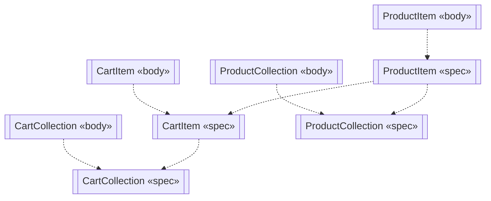
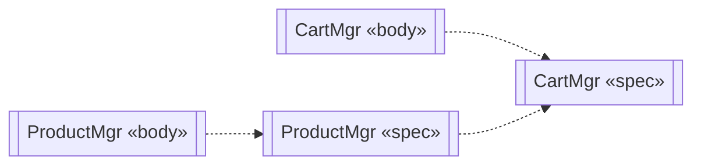
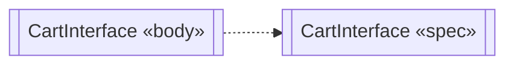
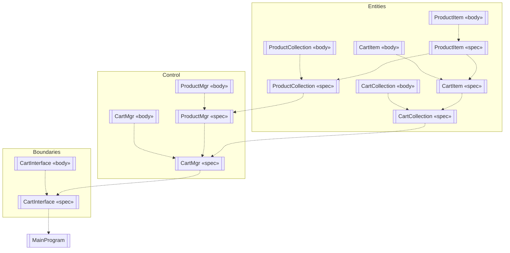

### Main Component Diagram

### Entities Package Component Diagram

### Control Package Component Diagram

### Boundaries Package Component Diagram

### System Component Diagram

### Component Diagrams for the Shopping Cart System

### What Was Done
Built five component diagrams modeling the deployment view of the shopping cart system: a Main Component diagram showing the three packages (Entities, Boundaries, Control) with their dependencies, three per-package diagrams showing the components inside each package (with package specifications and package bodies) and a System Component diagram showing all components together with the MainProgram and the full network of dependencies between them.

### Mermaid.js Steps
Used Mermaid's flowchart syntax with the subroutine shape [[...]] to approximate UML component boxes, and dashed arrows -.-> to represent UML dependency relationships. The «spec» and «body» labels were added inline to distinguish package specifications from package bodies. For the System Component diagram, subgraph blocks were used to visually group components into their packages.

### Why Flowchart Instead of Component Diagram
Mermaid does not natively support UML component diagrams. As a workaround, I used flowchart with subroutine-shaped nodes (which render with double vertical lines, similar to UML components) and dashed dependency arrows. Subgraphs represent the component packages. This reproduces the visual structure and dependency network of a UML component diagram.
