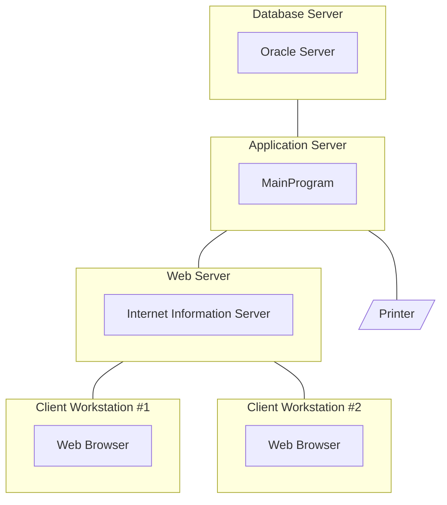

### Deployment Diagram for the Order Processing System

### What Was Done
Built a UML deployment diagram modeling the physical architecture of the Order Processing system. The diagram includes five processors (Database Server, Application Server, Web Server, Client Workstation #1, Client Workstation #2), one device (Printer) and five processes mapped to their respective processors (Oracle Server, MainProgram, Internet Information Server and two Web Browser instances). Five connections link the nodes to show the network communication paths.

### Mermaid.js Steps
Used Mermaid's flowchart syntax with subgraph blocks to represent processor nodes, with each running process declared as a node inside its parent subgraph. The Printer device was rendered with a parallelogram shape [/.../] to distinguish it visually from the processors. Undirected connection lines --- were used to model the network links between nodes.

### Why Flowchart Instead of Deployment Diagram
Mermaid does not natively support UML deployment diagrams. As a workaround, I used flowchart with subgraphs to represent processor nodes (which would be 3D cubes in proper UML notation) and placed the running processes inside them. This reproduces the structural relationship between processors, devices, processes and connections from a UML deployment diagram.
