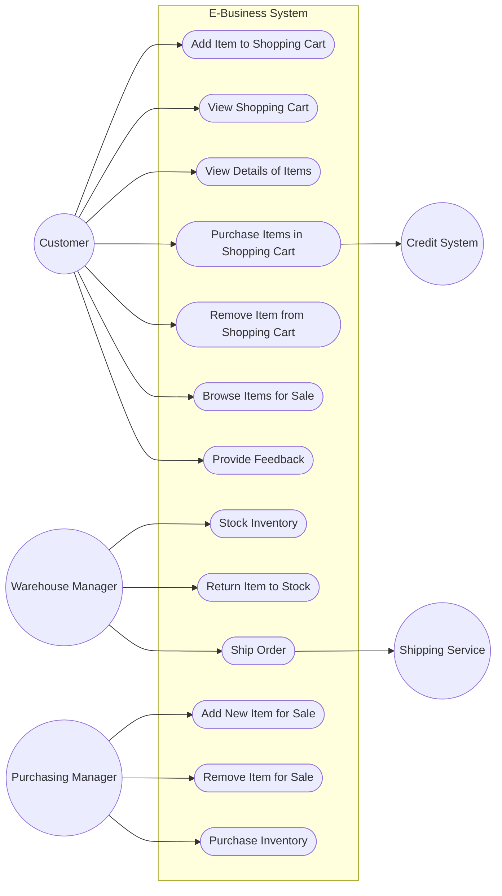

### Use Case Diagram for E-Business System
### What Was Done
Built a UML use case diagram modeling the order-processing e-business system. The diagram includes 13 system use cases (Add Item to Shopping Cart, View Shopping Cart, Purchase Items, Stock Inventory, Ship Order, Purchase Inventory, etc.) enclosed in a system boundary and 5 actors (Customer, Credit System, Warehouse Manager, Shipping Service, Purchasing Manager) with associations connecting them to the relevant use cases.

### Mermaid.js Steps
Used Mermaid's flowchart LR syntax with stadium-shaped nodes ([...]) to approximate the oval shape of UML use cases, and circle nodes (( )) to represent actors. The system boundary was drawn using a subgraph block and associations were added as directed arrows between actors and use cases.

### Why Flowchart Instead of Use Case Diagram
Mermaid does not natively support UML use case diagrams. As a workaround, I used flowchart LR with stadium shapes for use cases and circles for actors, wrapping the use cases in a subgraph to represent the system boundary. This reproduces the visual structure and associations of a UML use case diagram.

### Notation Limitation
Mermaid's circle nodes do not render as the traditional UML stick-figure actor symbol. This is a limitation of Mermaid's flowchart syntax — there is no built-in actor shape outside of sequence diagrams.

### Tool Choice
I chose Mermaid.js because I had already used it to build the architecture sequence diagram for the selected functionality per Ilin Maksim's task requirements.
