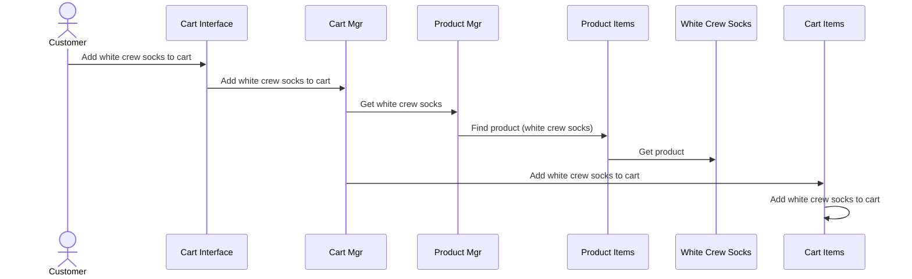
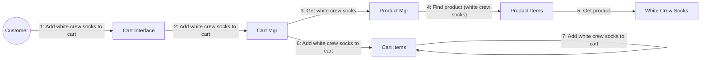

### Sequence Diagram

### Collaboration Diagram

### Sequence and Collaboration Diagrams for "Add Item to Shopping Cart"
### What Was Done
Built two interaction diagrams modeling the "Add Item to Shopping Cart" use case: a sequence diagram showing the time-ordered message flow between Customer, Cart Interface, Cart Mgr, Product Mgr, Product Items, White Crew Socks, Cart Items and a collaboration diagram showing the same interactions as numbered messages on object links.

### Mermaid.js Steps
For the sequence diagram, used Mermaid's native sequenceDiagram syntax with actor and participant declarations, then added arrows (->>) between lifelines with message labels, including a reflexive self-message on Cart Items.

### Why Flowchart Instead of Collaboration Diagram
Mermaid does not natively support UML collaboration (communication) diagrams. As a workaround, I used Mermaid's flowchart LR syntax with numbered message labels on the links (1–7), which faithfully reproduces the structure and numbering convention of a UML collaboration diagram.

### Duplicate Bottom Row in Sequence Diagram
The participant boxes appearing at both the top and bottom of the sequence diagram is not a notation error on my part — it is Mermaid's default rendering behavior. Mermaid automatically repeats participant headers at the bottom so that lifelines remain identifiable on long diagrams without scrolling back up. Mermaid provides no built-in option to suppress the bottom row.

### Tool Choice
I chose Mermaid.js because I had already used it to build the architecture sequence diagram for the selected functionality per lecturer's task requirements.
