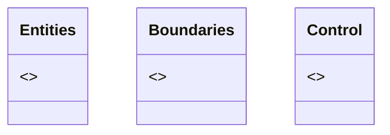
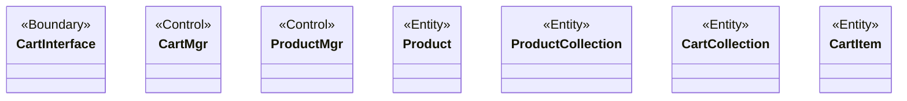
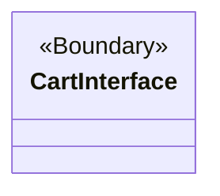
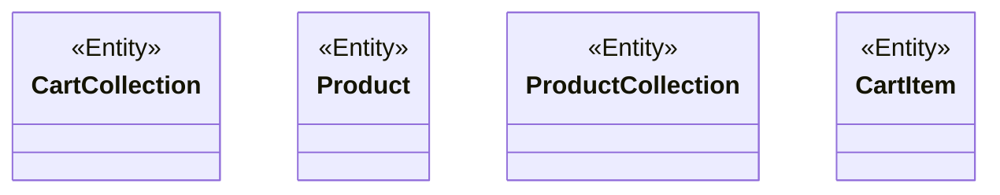
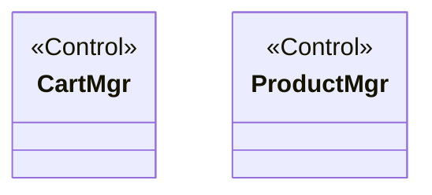

### Main Class Diagram (Packages)

### Add Item to Shopping Cart — All Classes with Stereotypes

### Boundaries Package — Main Class Diagram

### Entities Package — Main Class Diagram

###  Control Package — Main Class Diagram

