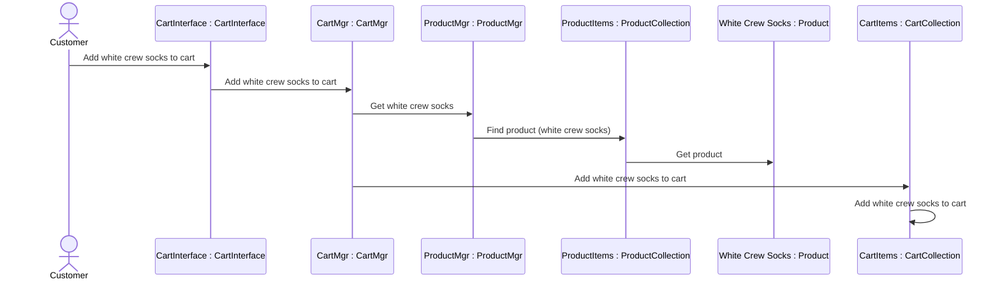
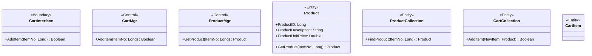

### Detailed Sequence Diagram (with class mappings)

### Add Item to Shopping Cart — Class Diagram with Attributes and Operations

### Detailed Class Diagram with Attributes and Operations

### What Was Done
Extended the "Add Item to Shopping Cart" model with two diagrams: a detailed sequence diagram where each object is explicitly mapped to its class (e.g. CartInterface : CartInterface, ProductItems : ProductCollection) and an updated class diagram with attributes and operations added to each class. Operations include AddItem, GetProduct and FindProduct with their parameters and return types and the Product class received three attributes: ProductID, ProductDescription and ProductUnitPrice.

### Mermaid.js Steps
Used Mermaid's native classDiagram syntax to declare attributes (+ProductID: Long) and operations (+AddItem(ItemNo: Long) Boolean) inside each class block. UML visibility was expressed using the + prefix for public members. For the sequence diagram, the participant Alias as Display Name syntax was used to render the UML object : class naming convention.

### Native Support, No Workaround Needed
Mermaid's classDiagram directly supports attributes, operations with parameters and return types, stereotypes and UML visibility notation. No flowchart fallback was required and the rendered output closely matches standard UML class diagram conventions.
