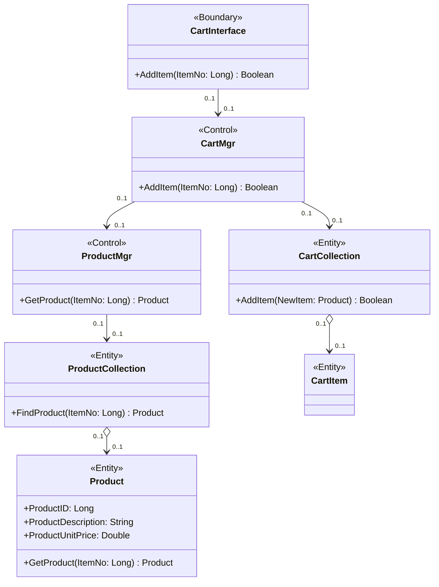

### Adding Relationships to the Class Diagram

### What Was Done
Extended the "Add Item to Shopping Cart" class diagram with relationships between the seven participating classes. Six unidirectional associations were added (CartInterface → CartMgr, CartMgr → ProductMgr, ProductMgr → ProductCollection, ProductCollection → Product, CartMgr → CartCollection, CartCollection → CartItem), each with zero-or-one multiplicity on both ends. Two of these were upgraded to aggregations: ProductCollection aggregates Product and CartCollection aggregates CartItem, reflecting the whole-part nature of those collections.

### Mermaid.js Steps
Used Mermaid's native classDiagram syntax to declare relationships between classes. Unidirectional associations were drawn with --> arrows and aggregations with o--> (open diamond on the "whole" side, arrow on the "part" side). Multiplicity was added inline using quoted strings on each end of the relationship (e.g. "0..1" --> "0..1").

### Native Support, No Workaround Needed
Mermaid's classDiagram directly supports all standard UML relationship types: associations, aggregations, compositions, dependencies and generalizations, along with multiplicity labels and directional arrows. No flowchart fallback was required and the rendered output closely matches standard UML class diagram conventions.
