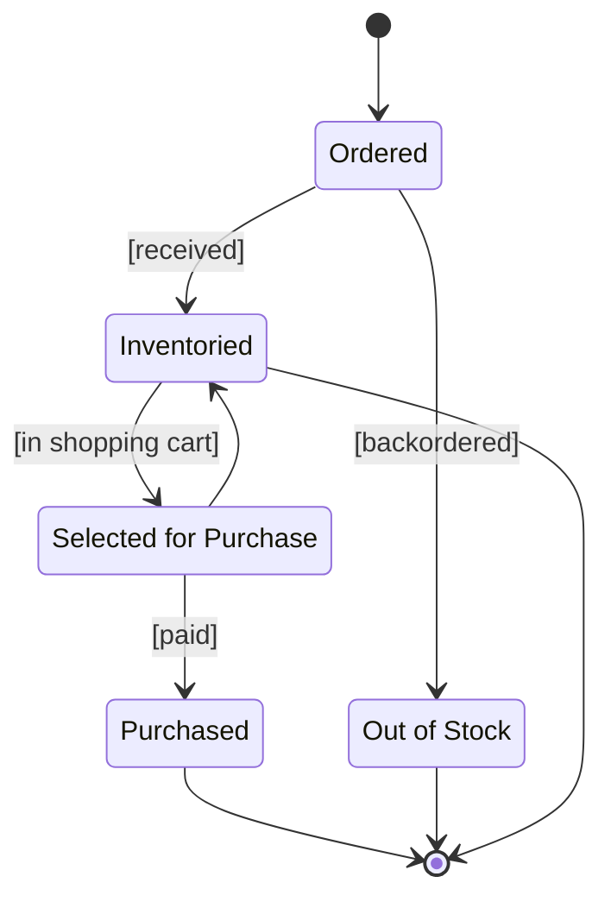

### Statechart Diagram for the Product Class

### What Was Done
Built a UML statechart diagram modeling the lifecycle of the Product class. The diagram includes a start state, an end state and five named states: Ordered, Inventoried, Out of Stock, Selected for Purchase and Purchased. Nine transitions connect the states, four of which carry guard conditions ([backordered], [received], [in shopping cart], [paid]) representing the business conditions that trigger each state change.

### Mermaid.js Steps
Used Mermaid's native stateDiagram-v2 syntax. The start and end states were declared with the [*] notation, transitions with --> arrows and guard conditions with the : [condition] label syntax. Multi-word state names were assigned display labels using the StateID : Display Name syntax to render spaces while keeping identifiers valid.

### Native Support, No Workaround Needed
Mermaid's stateDiagram-v2 directly supports all the elements required by this exercise: start/end states, named states, transitions with labels and guard conditions and even composite states for future extensions. No flowchart fallback was required, and the rendered output closely matches standard UML state machine notation.
